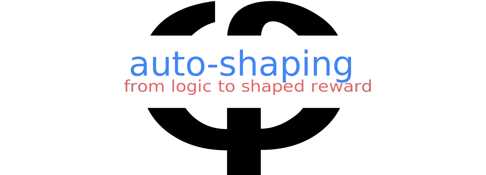

[](https://github.com/luigiberducci/auto-shaping)

<h2 align="center">
Specification-based library for automatic reward shaping.
</h2>

<p align="center">
<a href="https://opensource.org/licenses/MIT"></a>
<a href="https://python.org"></a>
<a href="https://github.com/luigiberducci/auto-shaping/actions/workflows/run-unit-tests-on-pr.yml/badge.svg"></a>
<a href="https://github.com/psf/black"></a>
</p>

## Methods

| Method                               | Dense Signal       | Multi-Objective    | Objective Prioritization | Status                |
|--------------------------------------|--------------------|--------------------|--------------------------|-----------------------|
| TLTL<sup>[1]</sup>                   | :x:                | :x:                | :x:                      | :heavy_check_mark:    |
| BHNR<sup>[2]</sup>                   | :heavy_check_mark: | :x:                | :x:                      | :heavy_check_mark:    |
| HPRS<sup>[4]</sup>                   | :heavy_check_mark: | :heavy_check_mark: | :heavy_check_mark:       | :heavy_check_mark:    |
| PAM<sup>[4]</sup>                    | :x:                | :heavy_check_mark: | :heavy_check_mark:       | :construction_worker: |
| Rank-Preserving Reward<sup>[5]</sup> | :x:                | :heavy_check_mark: | :heavy_check_mark:       | :construction_worker: |

:heavy_check_mark: Supported

:x: Not supported

:construction_worker: Work in progress

## Specification Language

The task specification consists of a set of requirements, as in [4]. The requirement syntax is as follows:

```
formula ::= f(state) ~ 0
requirement ::= ensure <formula> | achieve <formula> | conquer <formula> | encourage <formula>
```

where `f` is a function of the state dictionary `state`
and `~` is a comparison operator in `<`, `<=`, `>`, `>=`.

## Examples

To run the examples, ensure to install the extra requirements:

```
pip install -r examples/requirements.txt
```

Then, you can train an agent with `stable-baselines3` and `auto-shaping`

1. using default specifications from the configuration file in `configs/`
2. using a custom specification by passing it as an argument
3. benchmarking the agent with multiple reward shaping

# Citation

If you use this code in your research, please cite the following paper:

```
@misc{berducci2022hierarchical,
    title={Hierarchical Potential-based Reward Shaping from Task Specifications}, 
    author={Luigi Berducci and Edgar A. Aguilar and Dejan Ničković and Radu Grosu},
    year={2022},
    eprint={2110.02792},
    archivePrefix={arXiv},
    primaryClass={cs.LG}
}
```

# References

[1] "Reinforcement learning with temporal logic rewards." Li, et al. IROS 2017.

[2] "Structured reward shaping using signal temporal logic specifications." Balakrishnan, et al. IROS 2019.

[3] "Multi-objectivization of reinforcement learning problems by reward shaping." Brys, et al. IJCNN 2014.

[4] "Hierarchical Potential-based Reward Shaping." Berducci, et al. Under Review.

[5] "Receding Horizon Planning with Rule Hierarchies for Autonomous Vehicles." Veer, et al. ICRA 2023.
